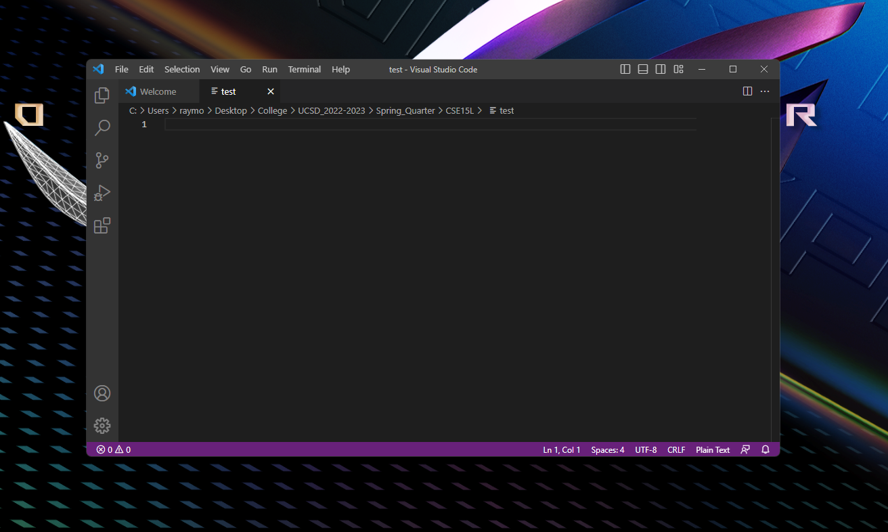

# Lab Report 1 - Remote Access and FileSystem

This tutorial documents my (rak007@ucsd.edu) process of logging into my course-specific account on `ieng6` on Windows. 

---

## Installing VS Code

As we use the terminal in VS Code for Remote Access, we were required to download [VS Code](https://code.visualstudio.com). 
If the user is using Windows, the user also had to download [Git Bash](https://gitforwindows.org/), in order to use Git Bash in terminal. 
However, as I already had VS Code from CSE 11 with Professor Cao, and Git Bash from personal projects, I did not have to separately download either installer.

Below is a picture of VS Code running on my Windows computer. 



---

## Remotely Connecting

### Creating a Git Bash Terminal

We then had to create a Git Bash terminal in VS Code. 

I first started by opening a terminal, then opening the command pallete with `Ctrl + Shift + P`. I typed in and clicked on 'Select Default Profile', then selected 'Git Bash' in the options displayed. 


By then clicking on the `+` button and clicking on the 'bash' option, I was able to add a Git Bash terminal in VS Code. 


Using the side panel on the right, I was able to toggle between the two terminal types as needed. This tutorial will only use the Git Bash terminal for the Remote Access. 


### Using SSH to Connect Remotely

#### Creating a CSE15L Account

In order to connect to the server, we need our login info for our CSE15L specific account. 
The details of such account can be found using the [Account Lookup Service](https://sdacs.ucsd.edu/~icc/index.php) from UCSD.

By inputting the student UCSD username and PID as shown below, the user will be taken to the Account Lookup Results page, where the CSE15L account will be displayed under the "Additional Accounts" section. 


Clicking on the CSE15L account, then the [Global Password Change Tool](https://sdacs.ucsd.edu/~icc/password.php) leads to a password reset page that looks like below. 


The user can proceed to the [Password Change Tool for Course-Specific Student Accounts](https://password.ucsd.edu), then input their UCSD username. 


If a password doesn't exist yet, a third option will be displayed to create a new password in the page shown below. The displayed image does not reflect this, as a password already exists for my CSE15L account. 


The user can then set up their password for their CSE15L account. This info will be used in the next section to log in to the remote server.

#### Using SSH

In the Git Bash Terminal, we connect to the server by inputting the following command below:

        $ ssh cs15lsp23nw@ieng6.ucsd.edu

where the username `cs15lsp23nw` is my CSE15L specific username. Sometimes, one may receive a prompt that looks as follows:

```
The authenticity of host 'ieng6.ucsd.edu (128.54.70.227)' can't be established.
RSA key fingerprint is SHA256:ksruYwhnYH+sySHnHAtLUHngrPEyZTDl/1x99wUQcec.
Are you sure you want to continue connecting (yes/no/[fingerprint])?
```

In this case, the user can just input `yes` into the terminal, then proceed to input their CSE15L password into the prompt.


By doing that, I was able to successfully login to the server and proceed to the login terminal, which looks like below.


---

## Trying Some Commands

Below are the server terminal results after runing a few different directory commands. 

### 1. Listing Directories

#### 1.1
        [cs15lsp23nw@ieng6-202]:~:$ ls


- `ls`, short for 'list directory', shows the content files and directories contained in the current or specified directory. As no path name is given after `ls`, all contents of the current directory is shown, with the only thing shown being a directory labeled `perl5`.

#### 1.2
        [cs15lsp23nw@ieng6-202]:~:$ ls -a


- In `ls -a`, the `-a` indicates a specific option - in this case, the option to show hidden files and directories within the current or specified directory. As no path is specified, all contents, both public and hidden, is shown for the current directory, including but not limited to `perl5`. 

#### 1.3
        [cs15lsp23nw@ieng6-202]:~:$ ls -lat


- Here, `-lat` indicates three different options, with `-l` for displaying detailed information about the listed files/directories, `-t` for displaying the files in the order of last modified, and `-a` the same as before.

### 2. Changing Directories

#### 2.1
        [cs15lsp23nw@ieng6-202]:~:$ cd perl5
        [cs15lsp23nw@ieng6-202]:perl5:$ ls
        [cs15lsp23nw@ieng6-202]:perl5:$ ls -a


- The `cd` command, short for 'change directory', indicates for the terminal to move directories to the one specified. In this case, as we specified the relative path of perl5 within the current directory, the terminal moves to perl5 as current directory. The `perl5` directory is currently empty, as listing public and hidden contents yield no result. 

#### 2.2
        [cs15lsp23nw@ieng6-202]:~:$ ls /home/linux/ieng6/cs15lsp23/cs15lsp23zz


- Here, we attempt to read another user's directory. This fails, as we do not have permission to access the directories. 

#### 2.3
        [cs15lsp23nw@ieng6-202]:~:$ cd /home/linux/ieng6/cs15lsp23/public 
        [cs15lsp23nw@ieng6-202]:public:$ ls


- We change directories to the `public` directory, located within the parent directory of our home directory. Listing all contents of `public` gives us various files and directories. We can use `cat` to print the contents as follows. 

### 3. Printing Items
        [cs15lsp23nw@ieng6-202]:public:$ cat hello.txt


### 4. Copying Items
        [cs15lsp23nw@ieng6-202]:public:$ cp hello.txt ~/
        [cs15lsp23nw@ieng6-202]:public:$ cd
        [cs151sp23nw@ieng6-202]:~: ls
        


- `cp`, short for 'copy', is a command that copies the file or directory in the first given path to the second given path. Here, we are copying the `hello.txt` file in the `public` directory over to our home directory. As shown above, we can see the copied `hello.txt` file in our home directory using `ls`.

### Summary

From our exploration, we can gather that the organization of the directories is something like below. 

* home
    * linux
        * ieng6
            * cs15lsp23
                * cs15lsp23nw (my home directory)
                    * perl5
                    * hello.txt
                * public
                    * README.class
                    * README.instructor
                    * bin
                    * broadcast
                    * broadcast.sh
                    * hello.txt
                    * modulefiles
                * (other users' directories)
 
And indeed, we can confirm such structure by changing directory to the `cs15lsp23` directory and listing its contents.

        [cs15lsp23nw@ieng6-202]:~:$ cd home/linux/ieng6/cs15lsp23
        [cs15lsp23nw@ieng6-202]:cs15lsp23:$ ls


---

## Wrapping Up

Once we are done exploring and running commands on the server, we can log out of our remote server in our terminal by running the following command. 

        exit


