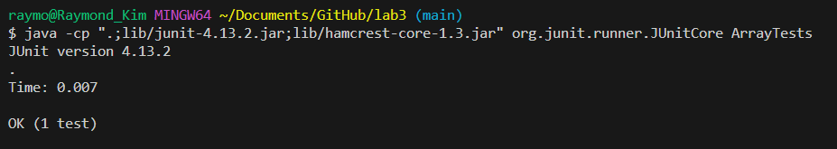
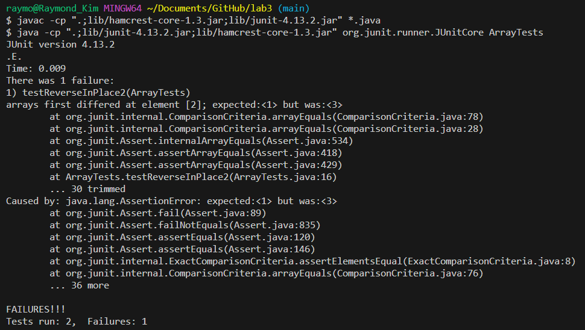
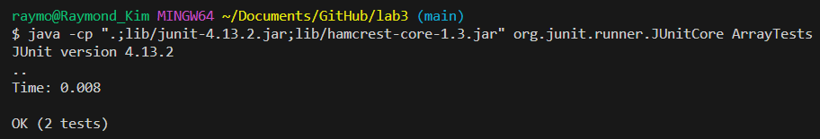

# Lab Report 2 - Servers and Bugs

---

## Part 1 - StringServer

We will first create a web server that tracks a string that we can add to and edit.

The code for StringServer.java is shown below. 

    import java.io.IOException;
    import java.net.URI;

    class Handler implements URLHandler {
        String cur_string = "";

        public String handleRequest(URI url) {
            String query = url.getQuery();
            if (url.getPath().equals("/add-message")) {
                String[] parameters = query.split("=");
                if (parameters[0].equals("s")) {
                    cur_string += parameters[1] + "\n";
                    return String.format("String %s added to running string", parameters[1]);
                } else {
                    return "/add-message query requires input value";
                }
            } else {
                return cur_string;
            }
        }
    }

    class StringServer {
        public static void main(String[] args) throws IOException {
            if(args.length == 0){
                System.out.println("Missing port number! Try any number between 1024 to 49151");
                return;
            }

            int port = Integer.parseInt(args[0]);

            Server.start(port, new Handler());
        }
    }

The string is saved in one variable `cur_string` with each individual string message divided via the newline character `\n`. 
The user can add new strings using the `/add-message` query, and use the root query `/` to display `cur_string`.
Examples of this are shown below. 

We add the string `"Hello"` to the running string using the `/add-message` query, by passing `"Hello"` as an argument.

We can verify the string was added by calling the root query. This shows that the value of `cur_string` is properly updated.

We can further verify that multiple strings can be added by adding another string.
Here, we add the string `"How are you"` to the `/add-message` query by passing it as an argument. 

And once again, by checking the root query, we can see the value of `cur_string` being properly updated. 

For both root queries of `/`, no value is updated as the code only calls for the return, and thus the display, of the value of `cur_string`.

---

## Part 2 - Bugs

The file of `ArrayExamples` has a few bugs in the code. One of the bugs is located in the `reverseInPlace` method, where the code for the method is shown below. 

The bugs are initially hidden when running the originally written test, which is shown below. 

        public class ArrayTests {
            @Test 
            public void testReverseInPlace() {
            int[] input1 = { 3 };
            ArrayExamples.reverseInPlace(input1);
            assertArrayEquals(new int[]{ 3 }, input1);
            }
        }

The result of this test shows no failure. 

However, writing a new test to test ArrayExamples.reverseInPlace() more thoroughly reveals hidden failures. 

        public class ArrayTests {
            @Test 
            public void testReverseInPlace() {
            int[] input1 = { 3 };
            ArrayExamples.reverseInPlace(input1);
            assertArrayEquals(new int[]{ 3 }, input1);
            }

          @Test
          public void testReverseInPlace2() {
            int[] input2 = {1, 2, 3};
            ArrayExamples.reverseInPlace(input2);
            assertArrayEquals(new int[]{3, 2, 1}, input2);
          }
        }

Observing the failure description `arrays first differed at element [2]; expected:<1> but was:<3>`, we can infer that the first two elements are reversed correctly, but the last element is not. 

We can find why this happened by breaking down the source code for ArrayExamples.reverseInPlace(), shown below. 

        public class ArrayExamples {
          // Changes the input array to be in reversed order
          static void reverseInPlace(int[] arr) {
            for(int i = 0; i < arr.length; i += 1) {
              arr[i] = arr[arr.length - i - 1];
            }
          }
        }

We see that the method iterates through the given array `arr` and sets each value to the `arr` value of the mirrored index. 
However, as we are directly changing the first half of values of `arr` during reversing, once we try changing the latter half values, nothing happens as the values supposed to be copied over are gone.
Going with the example given in our second test, `{1, 2, 3}` becomes `{3, 2, 3}`, as the value of index 0 changes, after which the values of index 1 and 2 remains unchanged. 

We can fix this by using another array as an intermediary, storing the reversed values separately from the initial `arr` as to not change or lose the initial data.

        public class ArrayExamples {

          // Changes the input array to be in reversed order
          static void reverseInPlace(int[] arr) {
            int[] arr2 = new int[arr.length];
            for (int i = 0; i < arr.length; i++) {
              arr2[i] = arr[i];
            }
            for (int i = 0; i < arr.length; i++) {
              arr[i] = arr2[arr.length - i - 1];
            }
          }
        }
        
And we can check that this implementation works by running the JUnit tests again.

## Part3 - Something New

During week 2 and week 3, I learned many things I did not know before. I learned how to use the command line to navigate and edit directories, as well as terminologies and methods of checking and fixing code, such as failures, symptoms, and bugs. 
