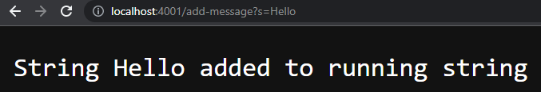
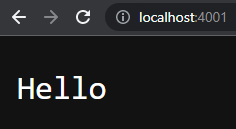
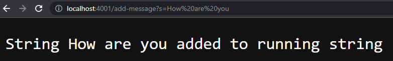
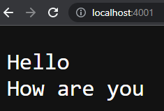

# Lab Report 2 - Servers and Bugs

---

## Part 1 - StringServer

We will first create a web server that tracks a string that we can add to and edit.

The code for StringServer.java is shown below. 

    import java.io.IOException;
    import java.net.URI;

    class Handler implements URLHandler {
        String cur_string = "";

        public String handleRequest(URI url) {
            String query = url.getQuery();
            if (url.getPath().equals("/add-message")) {
                String[] parameters = query.split("=");
                if (parameters[0].equals("s")) {
                    cur_string += parameters[1] + "\n";
                    return String.format("String %s added to running string", parameters[1]);
                } else {
                    return "/add-message query requires input value";
                }
            } else {
                return cur_string;
            }
        }
    }

    class StringServer {
        public static void main(String[] args) throws IOException {
            if(args.length == 0){
                System.out.println("Missing port number! Try any number between 1024 to 49151");
                return;
            }

            int port = Integer.parseInt(args[0]);

            Server.start(port, new Handler());
        }
    }

The string is saved in one variable `cur_string` with each individual string message divided via the newline character `\n`. 
The user can add new strings using the `/add-message` query, and use the root query `/` to display `cur_string`.
Examples of this are shown below. 

We add the string `"Hello"` to the running string using the `/add-message` query as an argument.

We can verify the string was added by calling the root query. This shows that the value of `cur_string` is properly updated.

We can further verify that multiple strings can be added by adding another string.
Here, we add the string `"How are you"` to the `/add-message` query by passing it as an argument. 

And once again, by checking the root query, we can see the value of `cur_string` being properly updated. 

For both root queries of `/`, no value is updated as the code only calls for the return, and thus the display, of the value of `cur_string`.

---

## Remotely Connecting

### Creating a Git Bash Terminal

